# InfraOps Center

Plataforma centralizada de observabilidade, monitoramento e automacao operacional de infraestrutura corporativa, desenvolvida para atender as necessidades de um ambiente corporativo real.

---

## Objetivo

O InfraOps Center centraliza monitoramento, observabilidade e automacoes operacionais em uma unica plataforma, reduzindo o tempo de resposta a incidentes e aumentando a disponibilidade da infraestrutura da empresa - servidores, rede, backups e servicos criticos, tudo em um unico painel.

---

## Arquitetura

```
Fontes de dados:
  - Servidores
  - pfSense (SNMP)
  - Access Points (UniFi API)
  - Impressoras
  - Raspberry Pi 5 (Controller)
        |
        v
  Blackbox Exporter
        |
        v
  Prometheus
        |
        v
  Alertmanager --> Telegram

Agentes / Integracoes / Automacoes
        |
        v
  FastAPI (Backend)
        |
        v
  PostgreSQL
        |
        v
  React (Dashboard Web)
```

Toda a stack roda em containers Docker sobre um Raspberry Pi 5, com HTTPS via Nginx Proxy Manager e backup automatizado replicado para dois servidores.

Servidores em redes remotas (ex: Fluig, Protheus), inacessiveis diretamente pelo Raspberry Pi, sao monitorados e controlados via um **agente proxy**: um servidor ja presente na rede interna, com VPN estabelecida, atua como intermediario - coletando metricas via WinRM e executando comandos remotos em nome do backend.

### Hardware

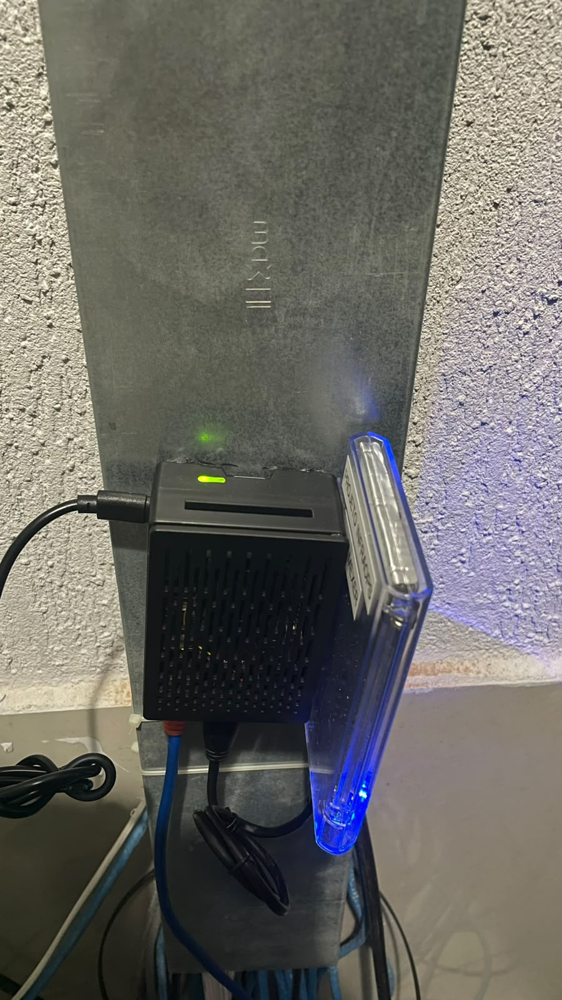

*O Raspberry Pi 5 que hospeda toda a stack — fixado com fita dupla-face, solução simples e funcional.*

---

## Nota sobre visualizacao

O projeto foi inicialmente concebido utilizando o Grafana como interface principal para visualizacao das metricas. Durante o desenvolvimento, optei por construir um dashboard proprio em React, permitindo autenticacao, controle de acesso por papeis (RBAC), experiencia personalizada e maior flexibilidade para futuras funcionalidades.

---

## Funcionalidades

### Monitoramento

- [x] Monitoramento de servidores Windows (CPU, RAM, multiplos discos, uptime)
- [x] Monitoramento de disponibilidade de servidores, access points e impressoras
- [x] Integracao com pfSense via SNMP (status e trafego em tempo real dos links WAN)
- [x] Integracao com UniFi Controller (clientes conectados por access point)
- [x] Blackbox Exporter para checagem de disponibilidade de rede
- [x] Monitoramento de servidores em redes remotas via agente proxy (WinRM)

### Seguranca

- [x] Backend proprio em FastAPI com autenticacao JWT
- [x] Controle de acesso por papeis - RBAC (super_admin, admin, operador)
- [x] Logs de auditoria de acoes sensiveis
- [x] Backup automatizado do banco de dados, replicado para dois servidores via SSH
- [x] HTTPS com certificado SSL e reverse proxy (Nginx Proxy Manager)
- [x] Rate limiting contra forca bruta em autenticacao

### Alertas

- [x] Alertas automaticos via Telegram (limites de uso, quedas de servico)
- [x] Resumo diario consolidado (so notifica quando ha problema real)
- [x] Sistema de cooldown para evitar alert fatigue (recursos instaveis notificam uma vez a cada 24h, nao a cada oscilacao)
- [x] Deteccao de indisponibilidade por ausencia de heartbeat

### Automacao

- [x] Fila de comandos (job queue) com worker remoto
- [x] Automacao de reinicializacao de servicos em sequencia controlada, com notificacao de inicio e conclusao
- [x] Historico de execucoes de automacoes, com autoria e resultado

### Continuidade de Negocio
- [x] Servidor de storage redundante, com replicacao ativa de dados e monitoramento continuo
- [x] Failover manual do servidor de arquivos principal para o redundante, via painel
- [x] Failover automatico com deteccao de queda por ausencia de heartbeat, com opcao de ativar/desativar
- [x] Verificacao de seguranca contra conflito de IP antes de executar o failover

### Interface
- [x] Dashboard web proprio em React, com graficos, historico e atualizacao em tempo real
- [x] Janela de tempo dos graficos ajustavel conforme a frequencia de atualizacao escolhida
- [x] Agentes de coleta personalizados (PowerShell) para servidores Windows

### DevOps
- [x] Pipeline de CI/CD via GitHub Actions, com deploy automatico a cada push na branch principal
- [x] Self-hosted runner rodando localmente, sem necessidade de expor a infraestrutura a internet

---

## Resultados

- Centralizacao do monitoramento de servidores, rede e backups em um unico painel
- Reducao do tempo de deteccao de falhas atraves de alertas automaticos em tempo real
- Consolidacao de notificacoes operacionais em um unico canal (Telegram)
- Visibilidade sobre uso de recursos (CPU, RAM, disco) por servidor, com historico
- Substituicao de verificacoes manuais recorrentes por monitoramento continuo
- Capacidade de executar acoes operacionais (reinicializacao de servicos) diretamente do painel, com rastreabilidade completa

---

## Desafios Tecnicos

- Padronizar coleta de metricas vindas de fontes heterogeneas: SNMP (pfSense), API REST (UniFi Controller), agentes PowerShell customizados (servidores Windows) e Blackbox Exporter (disponibilidade de rede)
- Diagnosticar e corrigir um bug de encoding UTF-8 em requisicoes PowerShell que causava falha silenciosa no registro de historico de backups
- Resolver inconsistencias de timezone entre PostgreSQL e Python (naive vs aware datetime) que faziam consultas de series temporais retornarem vazias mesmo com dados existentes
- Identificar e corrigir uma falha de resolucao de MIB em uma biblioteca SNMP que travava o event loop assincrono do backend inteiro, migrando a integracao para uma abordagem baseada em subprocess
- Implementar autenticacao JWT com RBAC, rate limiting e logs de auditoria em um backend proprio
- Automatizar backup do banco de dados com replicacao para dois servidores remotos via SSH, com autenticacao por chave publica
- Configurar HTTPS com resolucao de DNS consistente entre rede local e acesso remoto via VPN
- Projetar uma arquitetura de agente proxy para monitorar e automatizar servidores em redes inacessiveis diretamente, usando um servidor intermediario ja presente na rede de destino
- Implementar uma fila de comandos assincrona para execucao remota de automacoes, com feedback em tempo real via Telegram e rastreabilidade completa
- Implementar CI/CD em uma infraestrutura sem IP publico exposto, utilizando um self-hosted runner do GitHub Actions que executa localmente, eliminando a necessidade de abrir portas para a internet

---

## Estrutura de Pastas

```
backend/          API em FastAPI (autenticacao, metricas, integracoes, automacoes)
frontend/         Dashboard web em React
agents/           Agentes de coleta e automacao (PowerShell)
monitoring/       Configuracoes do Blackbox Exporter
prometheus/       Configuracoes e regras de alerta do Prometheus
alertmanager/     Template de notificacoes Telegram
scripts/          Scripts de automacao (backup, etc)
docker/           Docker Compose e orquestracao dos containers
security/         Certificados SSL
```

---

## Tecnologias

| Tecnologia | Funcao |
|---|---|
| **FastAPI** | Backend da plataforma - APIs REST para autenticacao, metricas, integracoes externas e automacoes |
| **PostgreSQL** | Persistencia de dados: usuarios, auditoria, historico de backups, metricas de agentes, status de rede e fila de automacoes |
| **Prometheus** | Coleta e armazenamento de metricas de infraestrutura |
| **Blackbox Exporter** | Checagem de disponibilidade (ping, TCP, HTTP) de servidores, access points, impressoras e paineis web |
| **Alertmanager** | Roteamento de alertas do Prometheus para o Telegram |
| **React** | Interface web do Dashboard - autenticacao, graficos em tempo real, navegacao por abas |
| **Docker / Docker Compose** | Orquestracao de todos os servicos em containers |
| **Nginx Proxy Manager** | Reverse proxy com certificado SSL, expoe o Dashboard via HTTPS |
| **GitHub Actions** | Pipeline de CI/CD, com self-hosted runner executando deploys automaticos localmente |

---

## Roadmap

- [x] Fase 1 - Infraestrutura base (Docker, PostgreSQL, FastAPI)
- [x] Fase 2 - Monitoramento (Prometheus, Blackbox Exporter)
- [x] Fase 3 - Alertas via Telegram
- [x] Fase 4 - Dashboard operacional em React
- [x] Seguranca (JWT, RBAC, auditoria, backup automatizado, HTTPS, rate limiting)
- [x] Modulo de Agentes (coleta de metricas de servidores Windows)
- [x] Integracao UniFi (clientes por access point)
- [x] Integracao pfSense (status e trafego de links WAN via SNMP)
- [x] Monitoramento Fluig (ambiente de testes)
- [x] Modulo de Automacoes (reinicializacao remota de servicos)
- [x] Monitoramento de servidor de storage redundante
- [x] Sistema de failover manual e automatico, com verificacao de seguranca
- [x] CI/CD (GitHub Actions com self-hosted runner, deploy automatico a cada push)
- [ ] Migracao do monitoramento do Fluig para o ambiente de producao
- [ ] Monitoramento Protheus

---

## 📸 Screenshots

### Login
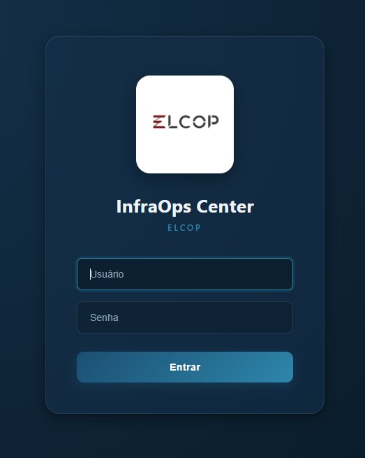

### Visão Geral
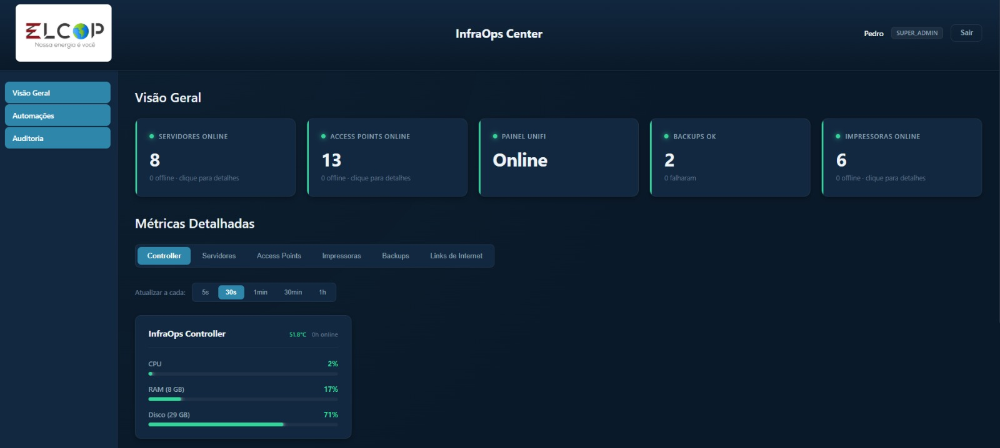

### Servidores
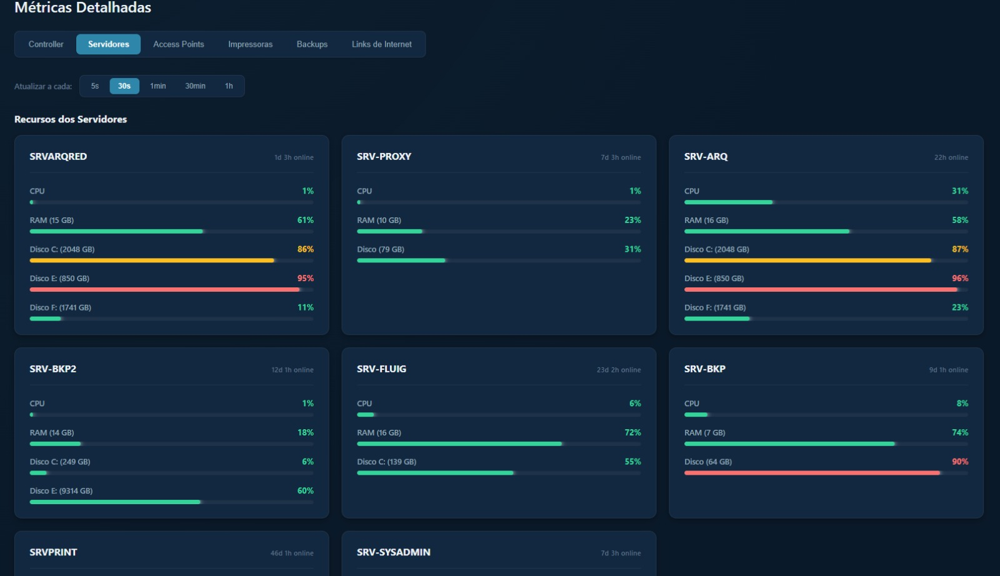

### Automações
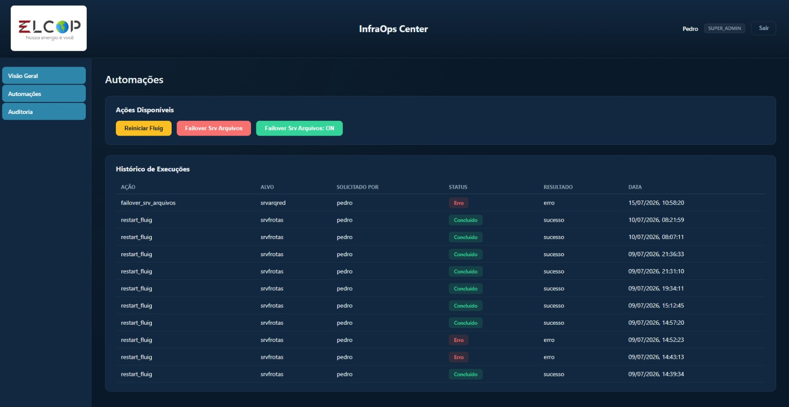

### Backups
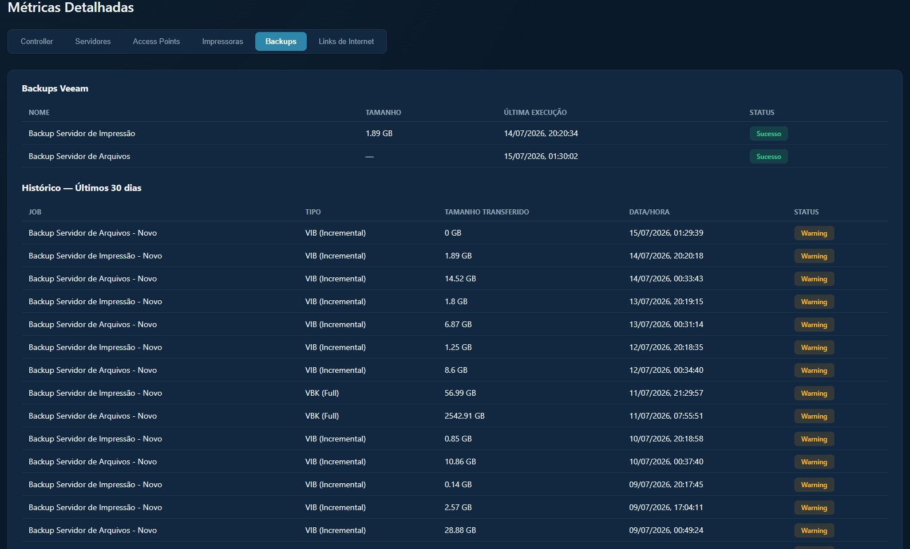

### Controller
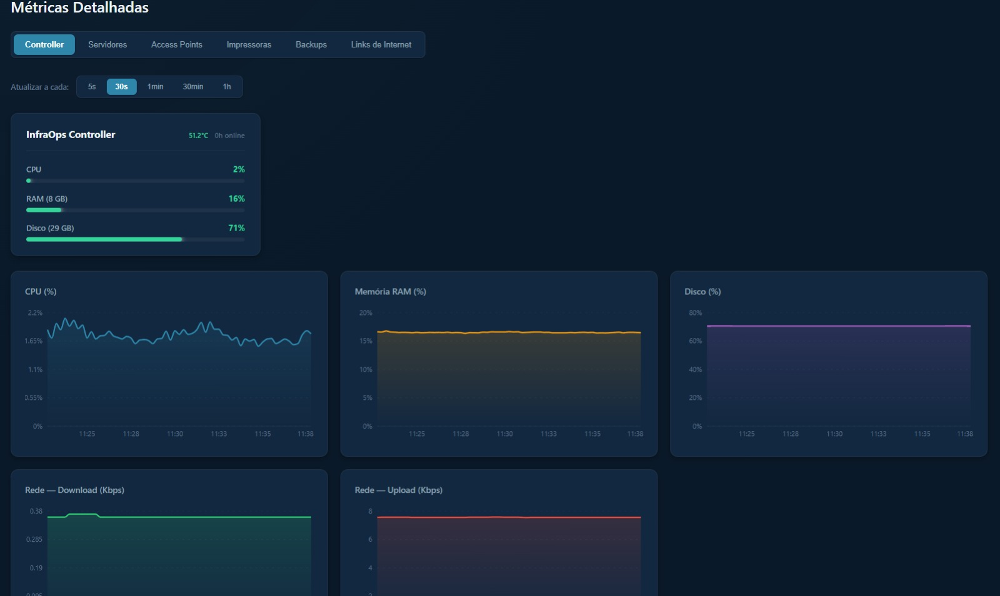

### Access Points
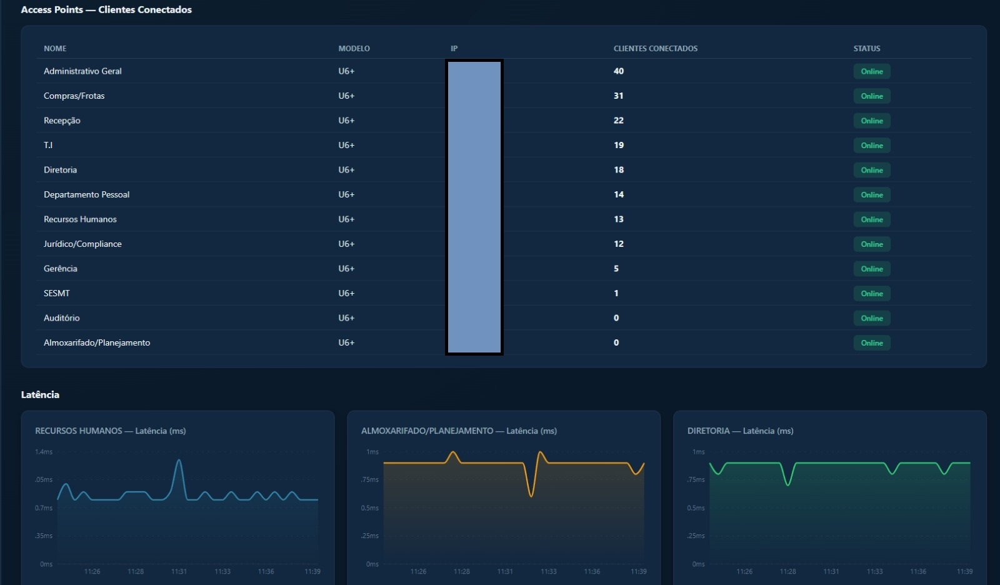

### Links de Rede
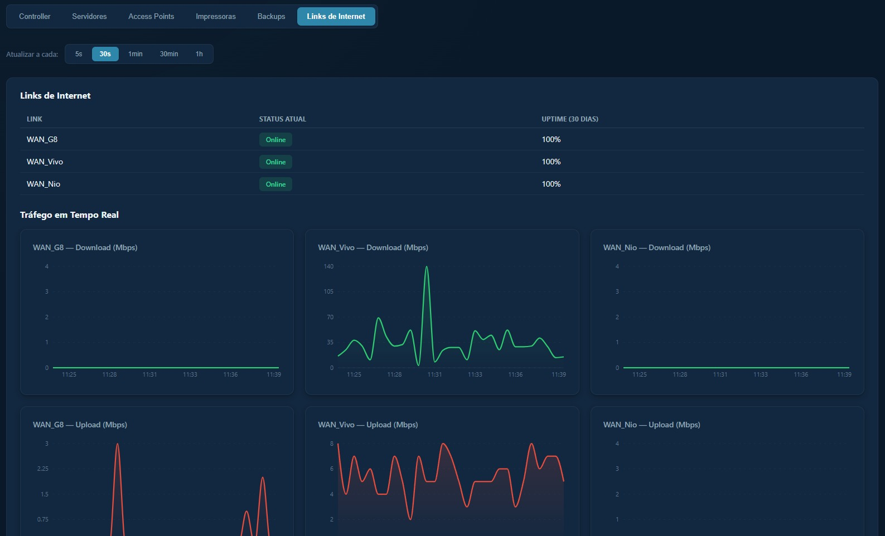

### Impressoras
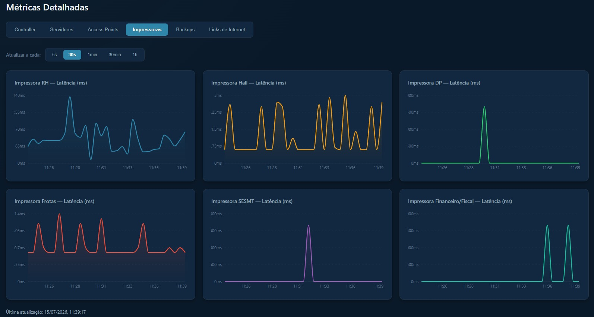

### Auditoria
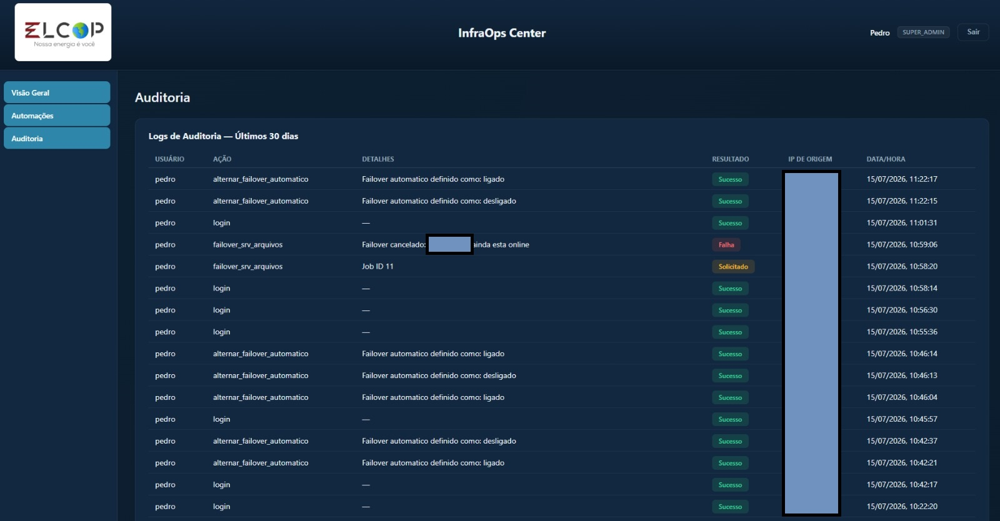

### Notificações via Telegram
Alertas automáticos de backup e status de infraestrutura enviados via bot do Telegram.

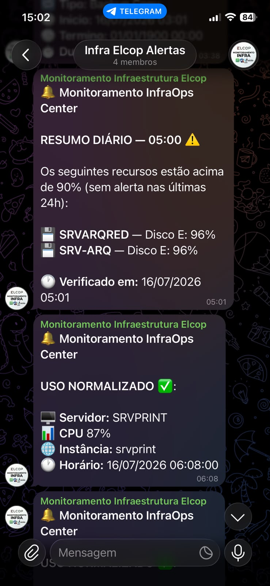
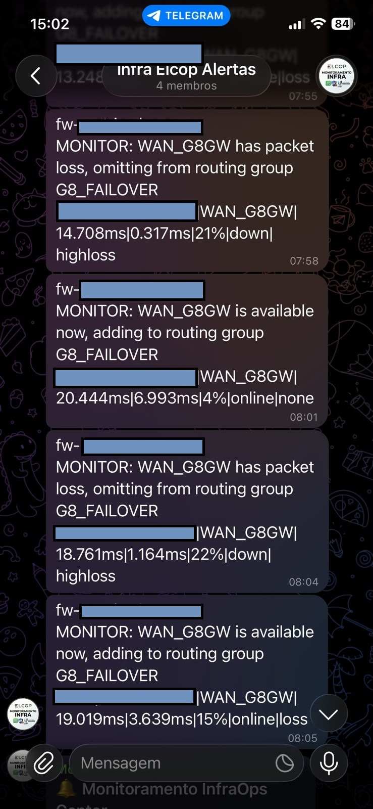
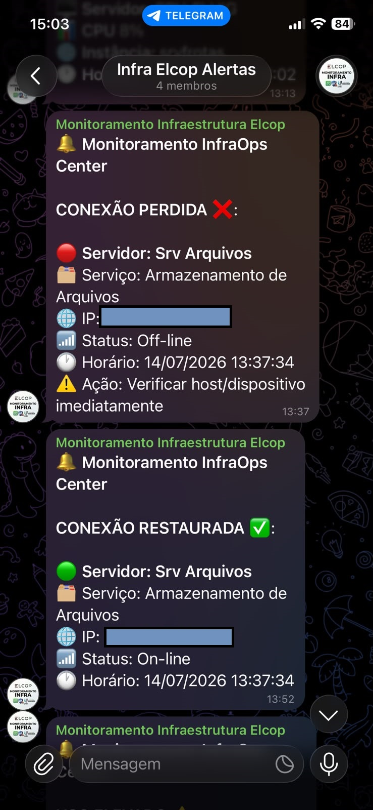
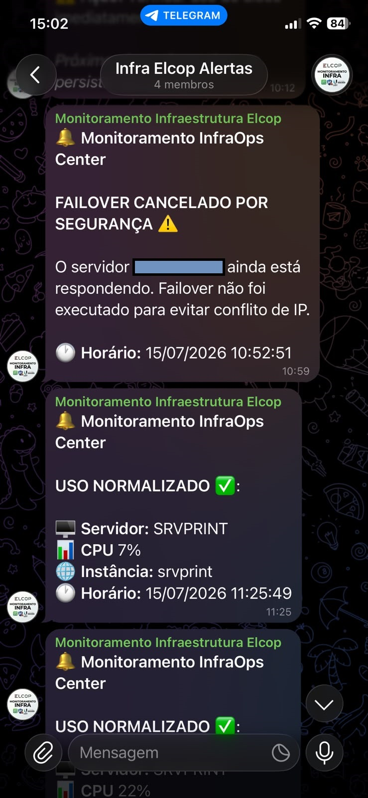
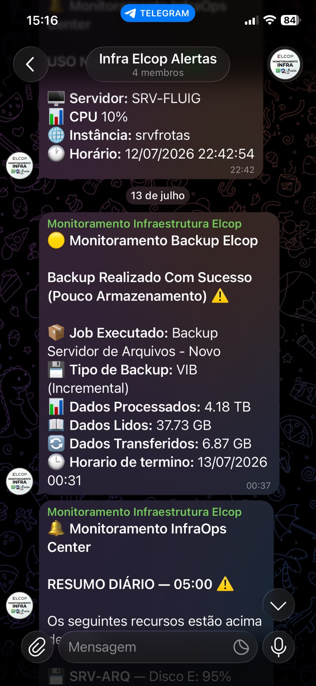

---

## Autor

Pedro Amaral
